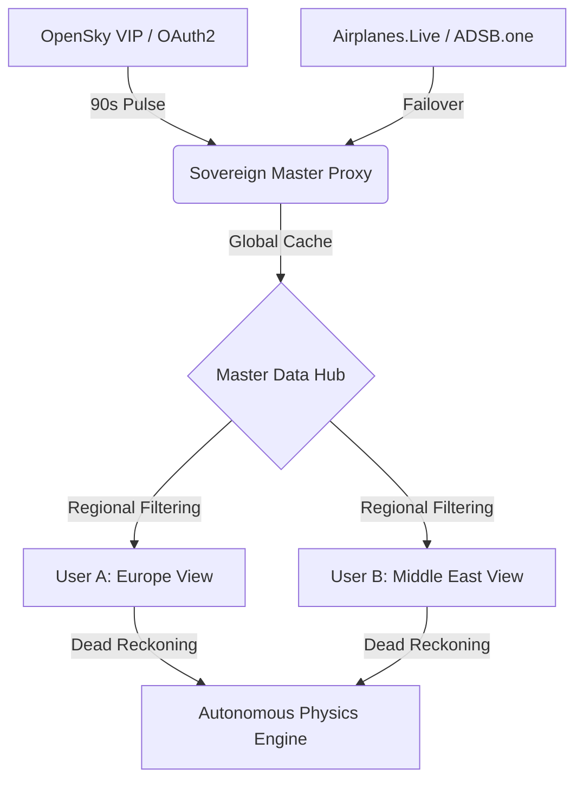

# 🌐 ShadowNet V8.0: Sovereign Intelligence Platform

[](https://github.com/RedRiveRR/ShadowNET)
[](LICENSE)
[](docker-compose.yml)
[](https://opensky-network.org/)

**ShadowNet**, 3D topolojik bir küre ve 2D taktik radardan oluşan, **Master Data Hub** mimarisine sahip profesyonel bir OSINT (Açık Kaynak İstihbarat) platformudur. V8.0 ile birlikte "Sovereign Proxy" ve "Otonom Fizik Motoru" entegre edilerek kredi sınırlamalarına takılmayan, 24 saat kesintisiz izleme kapasitesine sahip bir canavara dönüştürülmüştür.

---

## 🏗️ Technical Architecture (Master Data Hub)

ShadowNet, OpenSky VIP kredilerini korumak ve IP ban riskini sıfıra indirmek için merkezi bir senkronizasyon mimarisi kullanır.



### 💎 Key Innovations in V8.0

- **🚀 Sovereign Proxy Engine:** Sunucu, her 90 saniyede bir kez Global veri çeker. Kullanıcılar nereye bakarsa baksın, sunucu tek bir kredi (4 puan) harcayarak tüm dünyaya hizmet verir.
- **✈️ Autonomous Flight Physics (Dead Reckoning):** API verisi gelmediği (90 saniyelik boşluklar) süre boyunca uçaklar haritada donmaz; son hız ve yönlerine göre otonom olarak uçmaya devam ederler.
- **🛡️ Multi-Source Failover:** OpenSky hata verirse sistem sırasıyla Airplanes.Live, ADSB.one ve ADSB.lol kanallarına otomatik geçiş yapar.
- **📉 Intelligent Credit Preservation:** 4000 VIP krediyi 24 saate yayan dinamik ritmik tarama sistemi.

---

## 🐳 Docker Deployment (Professional Setup)

ShadowNet'i herhangi bir ortamda tek komutla ayağa kaldırın:

```bash
# Repo'yu klonlayın
git clone https://github.com/RedRiveRR/ShadowNET.git
cd ShadowNET

# .env dosyanızı hazırlayın
cp .env.example .env 

# Docker Compose ile başlatın
docker-compose up -d
```
Sistem anında `http://localhost:5173` adresinden yayına başlayacaktır.

---

## 🛠️ Requirements & Security

ShadowNet, hassas verilerinizi (`.env`) repository'ye sızdırmaz. `.gitignore` yapılandırması siber güvenlik standartlarına uygundur.

- **VITE_OPENSKY_CLIENT_ID:** OpenSky OAuth2 Client ID
- **VITE_OPENSKY_CLIENT_SECRET:** OpenSky OAuth2 Secret
- **VITE_OTX_API_KEY:** AlienVault Pulse Key
- **VITE_CLOUDFLARE_API_TOKEN:** Radar API Token

---

## 📝 Features & Modules

- **📡 Tactical Radar (2D):** Modern hava trafik kontrol terminali hissi veren, detaylı uçuş verisi ve hayalet iz (Ghost Track) destekli 2D görünüm.
- **🌍 Global Analytics (3D):** Fiberoptik siber saldırılar, BGP yönlendirme anomallikleri ve aktif sismik faaliyetlerin 3D visualizer'ı.
- **🪙 Whale Registry:** Blockchain üzerindeki yüksek hacimli finansal hareketlerin (Whale TX) coğrafi haritalandırılması.

## ⚖️ License
This project is licensed under the **MIT License**. Created and maintained by **RedRiveRR**.

---
*Developed for tactical awareness and global intelligence monitoring.*
