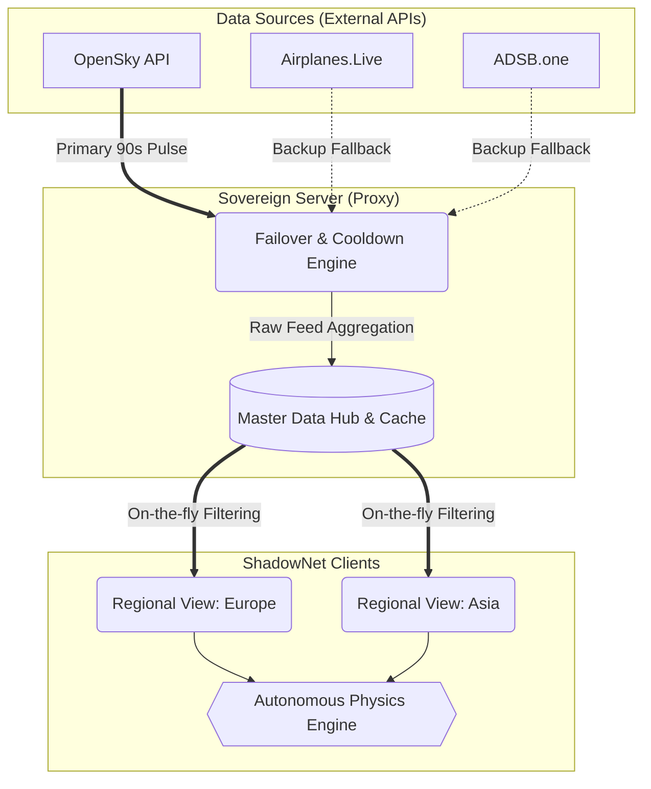

# 🌐 ShadowNet V8.0: Sovereign Intelligence Platform

[](https://github.com/RedRiveRR/ShadowNET)
[](LICENSE)
[](docker-compose.yml)
[](https://opensky-network.org/)
[](https://vitejs.dev/)

**ShadowNet**, siber güvenlik istihbaratını (OSINT), küresel kriz olaylarını, uzay yörüngelerini ve canlı hava sahası trafiğini tek bir çatı altında birleştiren, yüksek performanslı ve taktiksel bir komuta-kontrol platformudur. 

V8.0 ile birlikte entegre edilen **Master Data Hub** ve **Otonom Fizik Motoru (Dead Reckoning)** sayesinde ShadowNet, API kısıtlamalarına takılmayan, son derece stabil ve kesintisiz izleme kapasitesine sahip bir mimariye kavuşmuştur.

---

## 🚀 Mimarinin Kalbi: Sovereign Master Hub

ShadowNet V8.0, standart "her kullanıcı için ayrı API sorgusu" mantığını tarihe gömer. Bunun yerine sunucu tabanlı, tekil bir **Master Proxy** kullanır.



### 🧠 Teknik Otonomi Seçenekleri
- **Akıllı Kredi Koruma (90s Pulse):** Sunucu, OpenSky'dan tüm dünyanın havacılık verisini 90 saniyede bir kez çeker. Sitede ister 1 ister 100 kullanıcı olsun fazladan kredi harcanmaz. Böylece günlük API limitleriniz (örneğin 4000 istek/gün) hiçbir zaman aşılmaz ve 24 saate kusursuzca yayılır.
- **Failover / Cooldown (Kendini İyileştirme):** Birinciil sağlayıcı kesintiye uğrarsa, sunucu o API'yi 5 dakikalık "Soğuma" (Cooldown) moduna alır. Siz hiçbir kesinti hissetmeden anında `Airplanes.Live` veya `ADSB.one` gibi yedek ağlara otomatik geçiş yapılır.
- **Otonom İlerleme (Dead Reckoning):** 90 saniyelik veri boşluklarında radar ekranındaki uçaklar donmaz. **ShadowNet Physics Engine**, uçakların son raporlanan lokasyon, hız (kt) ve yön (heading) vektörlerini hesaplayarak otonom olarak süzülmeye devam etmelerini sağlar.

---

## 🛠️ Ana Modüller ve Veri Kaynakları

ShadowNet, iki ana görselleştirme arayüzünden oluşur: **3D Global Analytics** ve **2D Tactical Radar**.

### 🌍 3D Global Analytics (Küresel Bilgi Ağı)
Dünyanın 3 boyutlu topolojik yansıması üzerinde eş zamanlı kriz ve veri izleme modülü.
- **Siber Tehdit Sensörleri:** AlienVault OTX üzerinden güncel güvenlik zafiyatı "Pulse" ları.
- **BGP Yönlendirme Anomalileri:** Cloudflare Radar üzerinden internet trafik yönlendirme verileri.
- **Kripto Balina Ağı (Binance WS):** Binance WebSocket (btcusdt@aggTrade) üzerinden canlı veri çeker. Değeri $5,000 üzerindeki anlık yüksek hacimli kripto hareketlerini (Whale) haritada görselleştirir.
- **Sismik ve Afet Ağı:** USGS üzerinden gerçek zamanlı deprem (`mag` değerli sismik dalgalar) verilerini coğrafi koordinatlarıyla işleyip 3D radara uyarlar.
- **Yörünge Varlıkları (Orbital Assets):** CelesTrak (TLE formatı) ile yörüngedeki uyduları çeker. Uzay boşluğu katmanında uyduların yerini simüle eder.

### 📡 2D Tactical Radar (Hava Sahası Tarama)
NATO / Taktik komuta-kontrol terminallerinden ilham alınmış, Canvas tabanlı radar okuma ekranı.
- **Yüksek Kapasiteli Optimizasyon:** `requestAnimationFrame` ve Canvas 2D teknolojisiyle binlerce uçak görsel gecikme (lag) olmadan aynı anda render edilir.
- **Hayalet İzler (Ghost Tracks):** Sinyali kesilen uçaklar (örneğin okyanus üstünde) hemen silinmez. Radar sistemi 4 tarama döngüsü (6 dakika) boyunca bu uçakların tahmini rotasını soluk bir *GHOST TRACK* modunda çizmeye devam eder. 10. dakikada hiçbir veri gelmezse, "radar silinişi" (fading) yaşanır.
- **UI Terminal:** Sağ alt panelde "SCAN CYCLE" geri sayımı, "TACTICAL IDENTIFIERS" isimli canlı iz vs. hayalet iz farkını gösteren HUD tasarımı.

---

## ⚙️ Kurulum ve Dağıtım (Deployment)

Projenizi ayağa kaldırmak için iki seçeneğiniz vardır: Standart NPM Kurulumu veya Docker.

### Yöntem 1: Standart Başlangıç (Bare Metal)

1. Projeyi klonlayın:
```bash
git clone https://github.com/RedRiveRR/ShadowNET.git
cd ShadowNET
```

2. Paketleri yükleyin:
```bash
npm install
```

3. Çevresel değişkenleri hazırlayın:
`.env.example` dosyasını baz alarak kendi `.env` dosyanızı oluşturun (Değişkenler tablosuna bakın).

4. **Sistem Kontrol Aracı (Pre-flight Check)** ile kurulumunuzu doğrulayın:
```bash
node sys-check.js
```

5. Ateşleme:
```bash
npm run dev
```

*(Not: Proje derlemesi (build işlemi) Typescript hatalarından ve Rolldown/Vite Worker modüllerinden tam arındırılmıştır, `npm run build` komutu ile deploy edilebilir hale getirilmiştir.)*

### Yöntem 2: Dockerize Edilmiş Dağıtım (Daha Pratik)

Sistemi herhangi bir sunucuda Nodejs kurmadan çalıştırmak için hazır bir `docker-compose.yml` bulunmaktadır:
```bash
cp .env.example .env
docker-compose up -d --build
```
Sistem `http://localhost:5173` (veya config portunuzda) ayağa kalkacak, volume mapping sayesinde kod klasörleriniz korunacaktır.

---

## 🔐 Configuration / Çevresel Değişkenler

ShadowNet'in dış dünyayla konuşabilmesi için temel API anahtarları gereklidir. `.gitignore` dosyası `.env` uzantılarını dışlayacak şekilde tasarlandığından güvenlik riskiniz yoktur.

| Degişken | Kaynak / Amaç | Zorunlu mu? |
| :--- | :--- | :--- |
| `VITE_OPENSKY_CLIENT_ID` | OpenSky Authentication ID | Evet (B Planı var) |
| `VITE_OPENSKY_CLIENT_SECRET` | OpenSky Authentication Secret | Evet (B Planı var) |
| `VITE_OTX_API_KEY` | AlienVault OTX Siber Tehdit Anahtarı | Hayır |
| `VITE_CLOUDFLARE_API_TOKEN` | Yönlendirme (BGP) verisi için API Anahtarı | Hayır |

> **Not:** OpenSky anahtarları verilmezse sistem çökmez; tamamen otonom bir şekilde `Airplanes.live` gibi doğrulaması olmayan yedek (Backup) verikaynaklarına otomatik fall-back (düşüş) yapar. 

---

## 📜 Lisans & Yasal Uyarı

Bu proje **MIT License** altında lisanslanmıştır. Kullanım hakları referans vermek şartıyla serbesttir. Detaylar için [LICENSE](LICENSE) dizinini inceleyebilirsiniz.

*ShadowNet platformu osint, veri görselleştirme ve durumsal farkındalık deneyleri için yaratılmıştır. Havacılık, askeri ve acil durum bağlayıcılığı yoktur.*

---
*Created in the Shadows by RedRiveRR.*
