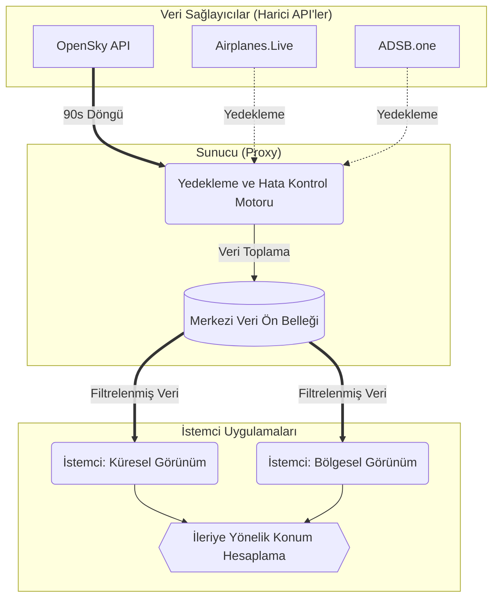

# ShadowNet V8.0

[](https://github.com/RedRiveRR/ShadowNET)
[](LICENSE)
[](docker-compose.yml)
[](https://vitejs.dev/)

ShadowNet, veri görselleştirme ve açık kaynak istihbaratı (OSINT) platformudur. Küresel havacılık trafiği, sismik aktiviteler, siber güvenlik tehditleri ve uydu yörünge verileri için gerçek zamanlı izleme ve analitik sağlar. Sürüm 8.0, API kullanımını optimize etmek ve sistem güvenilirliğini artırmak amacıyla merkezi bir proxy mimarisi (Merkezi Veri Yönetimi) sunmaktadır.

---

## Teknik Mimari

ShadowNet, gereksiz harici API isteklerini en aza indirmek ve servis limitlerini (rate limit) etkin bir şekilde yönetmek için merkezi bir veri toplama modeli kullanır.



### Temel Sistem Kabiliyetleri
- **Merkezi API Yönetimi:** Sunucu (backend proxy), küresel havacılık verilerini 90 saniyelik aralıklarla çeker. İstemciler (clientlar) verileri doğrudan bu merkezi önbellekten alır. Bu sayede API yükü dağıtılır ve eşzamanlı kullanıcı sayısından bağımsız olarak kota aşımlarının önüne geçilir.
- **Sağlayıcı Yedeklemesi (Failover):** Ana veri sağlayıcısının (OpenSky) ulaşılamaz olması veya hata kodları döndürmesi durumunda, sistem otonom olarak ikincil veri sağlayıcılarına (Airplanes.Live, ADSB.one) geçiş yapar.
- **Kesintisiz Veri İzleme (Dead Reckoning):** 90 saniyelik veri çekme döngüleri arasında grafiksel arayüz sürekliliğini sağlamak için, istemci uygulaması nesnelerin (uçakların) son bilinen hız ve yön vektörlerini kullanarak mevcut konumlarını matematiksel olarak hesaplar ve görselleştirmeye devam eder.

---

## Modüller ve Veri Kaynakları

Platform, iki birincil görselleştirme arayüzüne sahiptir: 3D küresel genel bakış ve 2D yerel radar görünümü.

### 1. Küresel Analitik (3D Görünüm)
Birden fazla entegrasyondan gelen coğrafi verileri işleyen interaktif bir 3D küre:
- **Siber Güvenlik Bildirimleri:** AlienVault OTX API aracılığıyla güncel güvenlik raporlarını derler ve görüntüler.
- **Ağ Trafik Anomalileri:** Cloudflare Radar BGP boru hattını (pipeline) kullanarak makroskopik internet yönlendirme verilerini görselleştirir.
- **Yüksek Hacimli Finansal İşlemler:** Gerçek zamanlı $5.000 USD üzerindeki kripto hareketleri için Binance WebSocket (`btcusdt@aggTrade`) verilerini izler.
- **Jeolojik Aktivite:** USGS akışından elde edilen deprem verilerini kullanarak mevcut sismik olayları haritalandırır.
- **Yörünge Takibi:** CelesTrak'tan alınan TLE (Two-Line Element) verilerini kullanarak belirli uyduların ve Uluslararası Uzay İstasyonu'nun (ISS) anlık konumlarını işler.

### 2. Yerel Hava Sahası Radarı (2D Görünüm)
Yüksek yoğunluklu render işlemleri için optimize edilmiş düz izdüşümlü Canvas arayüzü:
- **Performans Optimizasyonu:** HTML5 Canvas ve `requestAnimationFrame` teknolojilerini kullanarak on binlerce veri noktasını (uçak) minimum bellek tüketimi ve yüksek kare hızlarında (FPS) görüntüler.
- **Sinyal Kaybı Yönetimi:** Veri kesintisi yaşanması durumunda, sistem nesneyi otomatik olarak arayüzde dört okuma döngüsü (yaklaşık 6 dakika) boyunca tutar ve listeden tamamen çıkarmadan önce rotasını hesaplamaya (extrapolate) devam eder.

---

## Kurulum ve Dağıtım

ShadowNet, standart Node.js ortamlarında veya Docker konteynerleri aracılığıyla kurulabilir.

### Standart Kurulum

1. Repoyu klonlayın:
```bash
git clone https://github.com/RedRiveRR/ShadowNET.git
cd ShadowNET
```

2. Bağımlılıkları yükleyin:
```bash
npm install
```

3. Çevresel Değişkenler:
`.env.example` dosyasının adını `.env` olarak değiştirin ve ilgili API kimlik bilgilerinizi tanımlayın.

4. Derleme ve Başlatma:
```bash
npm run build
npm run preview
```
*(Geliştiriciler için not: Canlı önizleme ve geliştirme aşaması için `npm run dev` komutunu kullanınız).*

### Docker ile Kurulum

ShadowNet'i konteynerize edilmiş bir ortamda başlatmak için:
```bash
cp .env.example .env
docker-compose up -d --build
```
Uygulama varsayılan olarak `5173` portu üzerinden erişime açılacaktır.

---

## Konfigürasyon Değişkenleri

Uygulamanın dış API isteklerini yapabilmesi için belirli çevresel değişkenlere (.env) ihtiyacı vardır.

| Değişken | Amaç | Gereksinim |
| :--- | :--- | :--- |
| `VITE_OPENSKY_CLIENT_ID` | OpenSky Doğrulama Kimliği | Önerilir (Limitleri artırır) |
| `VITE_OPENSKY_CLIENT_SECRET` | OpenSky Doğrulama Şifresi | Önerilir |
| `VITE_OTX_API_KEY` | AlienVault OTX Anahtarı | İsteğe Bağlı |
| `VITE_CLOUDFLARE_API_TOKEN` | Cloudflare Radar API Token'ı | İsteğe Bağlı |

> **Not:** OpenSky kimlik bilgileri sağlanmazsa, sistem doğrulanmamış ikincil veri sağlayıcılarını (Airplanes.live vb.) kullanacak şekilde otonom olarak devreye girer.

---

## Lisans

Bu yazılım [MIT Lisansı](LICENSE) kapsamında dağıtılmaktadır.

---
*RedRiveRR tarafından geliştirilmiştir.*
